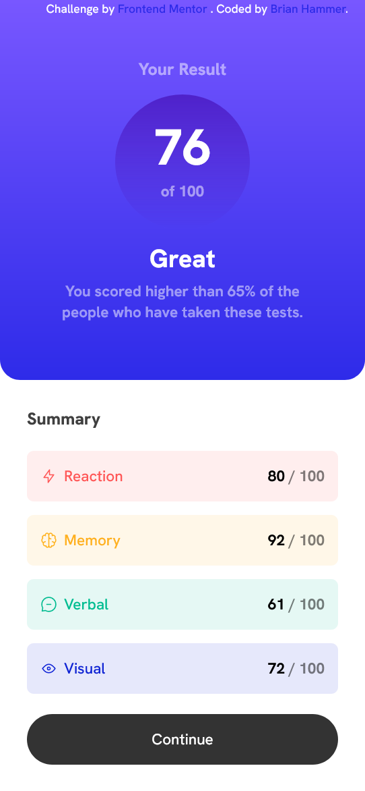
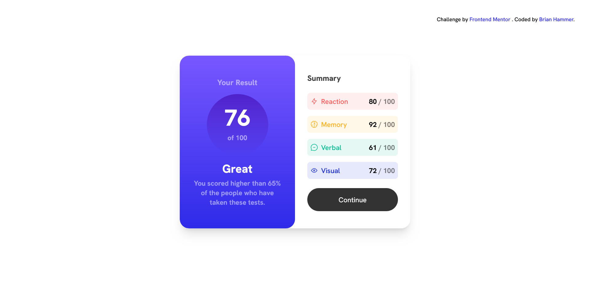

# Frontend Mentor - Results summary component solution

This is a solution to the [Results summary component challenge on Frontend Mentor](https://www.frontendmentor.io/challenges/results-summary-component-CE_K6s0maV). Frontend Mentor challenges help you improve your coding skills by building realistic projects.

## Table of contents

- [Overview](#overview)
  - [The challenge](#the-challenge)
  - [Screenshot](#screenshot)
  - [Links](#links)
- [My process](#my-process)
  - [Built with](#built-with)
  - [What I learned](#what-i-learned)
  - [Continued development](#continued-development)
- [Author](#author)

**Note: Delete this note and update the table of contents based on what sections you keep.**

## Overview

A responsive summary component built using tailwindcss.

### The challenge

Users should be able to:

- View the optimal layout for the interface depending on their device's screen size
- See hover and focus states for all interactive elements on the page
- **Bonus**: Use the local JSON data to dynamically populate the content

### Screenshot

Mobile:

Desktop:

### Links

- Solution URL: [https://github.com/BrianHammer/results-component](https://github.com/BrianHammer/results-component)
- Live Site URL: [https://brianhammer.github.io/results-component](https://brianhammer.github.io/results-component)

## My process

Built using tailwind CSS. I set up the project using the documentation, and then I plugged all the styles and fonts into tailwind.config. From there I worked on the mobile layout first, and then worked on the desktop layout.

### Built with

- HTML5
- TailwindCSS
- Responsive tailwind classes
- Tailwind Gradients
- Flexbox

### What I learned

I learned how to make a responsive element using tailwind css. 

### Continued development

I may use tailwind for my next app since there were many repeated classes and elements in this project. Using components instead of hardcoded HTML will make the code reusable and easier to edit.

## Author

- Frontend Mentor - [@BrianHammer](https://www.frontendmentor.io/profile/BrianHammer)